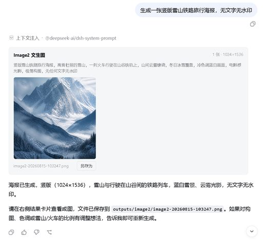
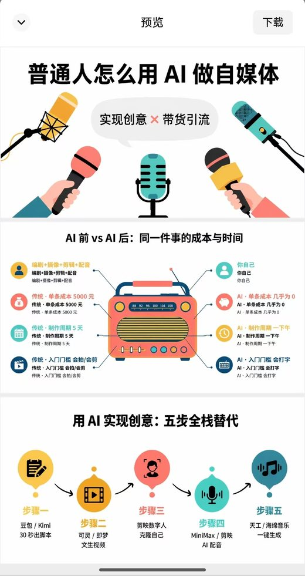

# Awesome AI Image Skills

[English](README.md)

给 Claude Code、Codex 等 agent 用的开源 **生图 skill 和 MCP 服务**:GPT Image、Nano Banana 与 Gemini、Flux 与 Stable Diffusion、图片编辑和设计素材。共 228 个仓库,每个都由 [Agent Skills Hub](https://agentskillshub.top?utm_source=github&utm_medium=awesome-list) 读过 README 并做了安全评级。

带类型筛选的在线页面:**[https://agentskillshub.top/best/image-generation/](https://agentskillshub.top/best/image-generation/?utm_source=github&utm_medium=awesome-list)** · 每 8 小时刷新

## 这些 skill 能做出什么

<table>
<tr>
<td align="center" valign="top" width="33%"><b>🔌 MCP 服务</b> 75 个仓库   给 AI 助手提供生图能力、可接多个模型的 MCP 服务。 <a href="#type-mcp"><b>查看列表 →</b></a></td>
<td align="center" valign="top" width="33%"><b>🟢 GPT Image</b> 89 个仓库   基于 OpenAI 的 GPT Image 和 DALL-E。 <a href="#type-gpt_image"><b>查看列表 →</b></a></td>
<td align="center" valign="top" width="33%"><b>🍌 Nano Banana 与 Gemini</b> 25 个仓库   基于 Google 的 Nano Banana、Gemini 和 Imagen。 <a href="#type-nano_banana"><b>查看列表 →</b></a></td>
</tr>
<tr>
<td align="center" valign="top" width="33%"><b>🧪 开源模型</b> 17 个仓库  Flux、Stable Diffusion、ComfyUI,多可自托管。 <a href="#type-open_models"><b>查看列表 →</b></a></td>
<td align="center" valign="top" width="33%"><b>✂️ 图片编辑</b> 2 个仓库  修图、抠图、放大、局部重绘。 <a href="#type-editing"><b>查看列表 →</b></a></td>
<td align="center" valign="top" width="33%"><b>🎨 设计素材</b> 20 个仓库  图标、插画、封面、海报和 Logo。 <a href="#type-design"><b>查看列表 →</b></a></td>
</tr>
</table>

## 目录

- [🔌 MCP 服务](#type-mcp) (75)
- [🟢 GPT Image](#type-gpt_image) (89)
- [🍌 Nano Banana 与 Gemini](#type-nano_banana) (25)
- [🧪 开源模型](#type-open_models) (17)
- [✂️ 图片编辑](#type-editing) (2)
- [🎨 设计素材](#type-design) (20)

## 什么样的仓库能上榜

1. 它让 AI agent 或助手通过图像模型生成或编辑图片。没有工具的提示词合集、模型本身的训练代码、通用聊天应用不算。
2. 它是能安装或运行的软件,不是链接合集或空仓库。
3. 它有 README。没有 README 就没法评级。
4. 50 星及以上只看是否切题;50 星以下还要过 README 质量线(展示效果、一条命令上手、说清产出、文档完整),并且至少 5 星。

这些问题由决策模型逐个读 README 回答,不是人工挑选。卡在线上的仓库可能判到任一边,归错了请提 issue。

## 🔌 MCP 服务

[在在线页面打开这一类,按星数排序 →](https://agentskillshub.top/best/image-generation/?utm_source=github&utm_medium=awesome-list#type-mcp)

<table><tr>
<td align="center" valign="top"> <a href="https://github.com/PUSHINGSQUARES/pushing-creation">PUSHINGSQUARES/pushing-creation</a></td>
</tr></table>

| 仓库 | 星数 | 做什么 | 安全评级 |
|---|---:|---|---|
| [SamurAIGPT/Generative-Media-Skills](https://github.com/SamurAIGPT/Generative-Media-Skills) | 5.5k | 面向 AI agent 的多模态媒体生成 skill（Claude Code、Cursor、Gemini CLI），由 muapi.ai 提供图像、视频和音频… | [SAFE](https://agentskillshub.top/skill/SamurAIGPT/Generative-Media-Skills/?utm_source=github&utm_medium=awesome-list) |
| [llmsresearch/paperbanana](https://github.com/llmsresearch/paperbanana) | 2.4k | Google Research 的 PaperBanana 开源实现与扩展，用于自动生成学术图表、示意图和研究视觉内容，并扩展至幻灯片生成等领域。 | [SAFE](https://agentskillshub.top/skill/llmsresearch/paperbanana/?utm_source=github&utm_medium=awesome-list) |
| [jau123/MeiGen-AI-Design-MCP](https://github.com/jau123/MeiGen-AI-Design-MCP) | 1.8k | 支持 GPT Image 2、Seedance 和 ComfyUI，含 1,400+ 提示词库、hooks 和多任务编排系统 | [SAFE](https://agentskillshub.top/skill/jau123/MeiGen-AI-Design-MCP/?utm_source=github&utm_medium=awesome-list) |
| [MiniMax-AI/MiniMax-MCP](https://github.com/MiniMax-AI/MiniMax-MCP) | 1.6k | 官方 MiniMax MCP 服务器，支持调用文本转语音、图像生成和视频生成 API。 | [SAFE](https://agentskillshub.top/skill/MiniMax-AI/MiniMax-MCP/?utm_source=github&utm_medium=awesome-list) |
| [scenario-labs/skills](https://github.com/scenario-labs/skills) | 923 | agent图像/视频/音频/3D；skills选模型定价，ScenarioMCP角色品牌一致；Blender/Maya/ZBrush/Unreal/Unity。 | [SAFE](https://agentskillshub.top/skill/scenario-labs/skills/?utm_source=github&utm_medium=awesome-list) |
| [lidge-ai/ima2-gen](https://github.com/lidge-ai/ima2-gen) | 865 | 面向用户和编码代理的本地优先视觉生成运行时与工作室，支持跨多个提供商的可复现图像和视频工作流。 | [SAFE](https://agentskillshub.top/skill/lidge-ai/ima2-gen/?utm_source=github&utm_medium=awesome-list) |
| [artokun/comfyui-mcp](https://github.com/artokun/comfyui-mcp) | 797 | ComfyUI 的本地优先 agent 控制平面：MCP server 与侧边栏 agent 可生成多媒体、编写运行工作流，并借任意 LLM 自然语言编辑实时图 | [SAFE](https://agentskillshub.top/skill/artokun/comfyui-mcp/?utm_source=github&utm_medium=awesome-list) |
| [smixs/visual-skills](https://github.com/smixs/visual-skills) | 487 | agent电影导演skill：戏剧（Murch、调度、蒙太奇）及Seedance、Kling、Veo、Nano Banana、GPT Image精确提示词语法 | [SAFE](https://agentskillshub.top/skill/smixs/visual-skills/?utm_source=github&utm_medium=awesome-list) |
| [AKCodez/higgsfield-claude-skills](https://github.com/AKCodez/higgsfield-claude-skills) | 406 | 19个Higgsfield AI Claude Code skills：用Playwright自动化图像生成、Seedance 2.0视频制作及完整UGC广告… | [SAFE](https://agentskillshub.top/skill/AKCodez/higgsfield-claude-skills/?utm_source=github&utm_medium=awesome-list) |
| [zhongweili/nanobanana-mcp-server](https://github.com/zhongweili/nanobanana-mcp-server) | 400 | 由 Google Gemini 驱动的 AI 图像生成 MCP 服务器，支持模型选择和 4K 输出 | [SAFE](https://agentskillshub.top/skill/zhongweili/nanobanana-mcp-server/?utm_source=github&utm_medium=awesome-list) |
| [tmchow/illo-skill](https://github.com/tmchow/illo-skill) | 385 | illo skill：将创意和文章转为原创印刷风编辑插画，含固定吉祥物、30多个角色包，并可自定义。 | [SAFE](https://agentskillshub.top/skill/tmchow/illo-skill/?utm_source=github&utm_medium=awesome-list) |
| [Comfy-Org/comfy-mcp](https://github.com/Comfy-Org/comfy-mcp) | 262 | 供 AI agents 运行本地 ComfyUI 的本地 MCP server | [SAFE](https://agentskillshub.top/skill/Comfy-Org/comfy-mcp/?utm_source=github&utm_medium=awesome-list) |
| [Hao0321/ai-media-generator](https://github.com/Hao0321/ai-media-generator) | 257 | Claude Code Skill，用于生成 AI 图像、视频和音乐提示词，并在 14+ 生成平台中通过浏览器执行。 | [SAFE](https://agentskillshub.top/skill/Hao0321/ai-media-generator/?utm_source=github&utm_medium=awesome-list) |
| [ConstantineB6/comfy-pilot](https://github.com/ConstantineB6/comfy-pilot) | 231 | MCP 服务器和内置终端，让 Claude Code 查看并编辑 ComfyUI 工作流 | [SAFE](https://agentskillshub.top/skill/ConstantineB6/comfy-pilot/?utm_source=github&utm_medium=awesome-list) |
| [kodelyx/flow-agent](https://github.com/kodelyx/flow-agent) | 204 | Google Flow CLI 工具包，支持 Nano Banana Pro 图像、Omni Flash 视频、MCP v2 和 OpenAI API | [SAFE](https://agentskillshub.top/skill/kodelyx/flow-agent/?utm_source=github&utm_medium=awesome-list) |
| [glibsonoran/Plush-for-ComfyUI](https://github.com/glibsonoran/Plush-for-ComfyUI) | 199 | ComfyUI/Stable Diffustion 自定义节点 | [SAFE](https://agentskillshub.top/skill/glibsonoran/Plush-for-ComfyUI/?utm_source=github&utm_medium=awesome-list) |
| [GENEXIS-AI/gpt-image-skill](https://github.com/GENEXIS-AI/gpt-image-skill) | 174 | 使用 ChatGPT 订阅，通过 Codex 或 Claude Code 生成 GPT 图像，无需 Images API。 | [SAFE](https://agentskillshub.top/skill/GENEXIS-AI/gpt-image-skill/?utm_source=github&utm_medium=awesome-list) |
| [shinpr/mcp-image](https://github.com/shinpr/mcp-image) | 172 | 用于 AI 图像生成与编辑的 MCP server，支持自动提示词优化、质量预设及 Nano Banana (Gemini)、OpenAI GPT Image… | [SAFE](https://agentskillshub.top/skill/shinpr/mcp-image/?utm_source=github&utm_medium=awesome-list) |
| [Tencent/workrally](https://github.com/Tencent/workrally) | 155 | 面向 AI Agent 的 AIGC 漫剧视频全流程创作工具集 | [SAFE](https://agentskillshub.top/skill/Tencent/workrally/?utm_source=github&utm_medium=awesome-list) |
| [doudou770/flyreq-image-studio](https://github.com/doudou770/flyreq-image-studio) | 150 | AI生图与视频工作台，支持Agent、无限画布、素材管理、PWA及Grok、GPT Image 2等模型，适配手机端。 | [SAFE](https://agentskillshub.top/skill/doudou770/flyreq-image-studio/?utm_source=github&utm_medium=awesome-list) |
| [Moeblack/ComfyUI-AnimaTool](https://github.com/Moeblack/ComfyUI-AnimaTool) | 137 | 用于 Anima 动漫/插画图像生成的 AI 工具调用 API，支持 MCP Server、HTTP API 和 CLI。 | [SAFE](https://agentskillshub.top/skill/Moeblack/ComfyUI-AnimaTool/?utm_source=github&utm_medium=awesome-list) |
| [iconben/z-image-studio](https://github.com/iconben/z-image-studio) | 129 | 基于 Tongyi-MAI/Z-Image-Turbo 及其量化模型的 CLI、webUI 和 MCP server | [SAFE](https://agentskillshub.top/skill/iconben/z-image-studio/?utm_source=github&utm_medium=awesome-list) |
| [joeseesun/qiaomu-codex-imagegen](https://github.com/joeseesun/qiaomu-codex-imagegen) | 120 | 让任意 Agent 通过 MCP、CLI 和 skill 调用 Codex 生图，内置小红书、视频封面和 Mondo 海报技巧 | [SAFE](https://agentskillshub.top/skill/joeseesun/qiaomu-codex-imagegen/?utm_source=github&utm_medium=awesome-list) |
| [RioShiina47/comfy-webui](https://github.com/RioShiina47/comfy-webui) | 119 | 基于配方的 ComfyUI WaaS 平台，将图像、音频、视频和 3D 工作流转为直观的 Gradio 界面、高级语义 API 及供 LLM 和 AI age… | [SAFE](https://agentskillshub.top/skill/RioShiina47/comfy-webui/?utm_source=github&utm_medium=awesome-list) |
| [awkoy/replicate-flux-mcp](https://github.com/awkoy/replicate-flux-mcp) | 106 | 用于 Replicate Flux Model 的 MCP，生成符合指定编程风格和审美的图像与 SVG 资源。 | [SAFE](https://agentskillshub.top/skill/awkoy/replicate-flux-mcp/?utm_source=github&utm_medium=awesome-list) |
| [SlavaSexton/ComfyUI-Agent-Kit](https://github.com/SlavaSexton/ComfyUI-Agent-Kit) | 105 | 适用于 AI coding agent 的 ComfyUI skill：驱动本地 ComfyUI，含75个配方、581个模板。 | [SAFE](https://agentskillshub.top/skill/SlavaSexton/ComfyUI-Agent-Kit/?utm_source=github&utm_medium=awesome-list) |
| [Subaru486desuwa/micu-image-mcp](https://github.com/Subaru486desuwa/micu-image-mcp) | 102 | 封装米醋 gpt-image-2 / gpt-image-2-pro 代理的 MCP server，可安装到 Claude Code、Codex、Cursor | [SAFE](https://agentskillshub.top/skill/Subaru486desuwa/micu-image-mcp/?utm_source=github&utm_medium=awesome-list) |
| [hassancs91/claude-image-generation](https://github.com/hassancs91/claude-image-generation) | 101 | 用 Agent Skills 连接 Claude 与图像生成：代码设计引擎、Three.js 3D 渲染器和 Cloudflare 扩散模型；AI Story… | [SAFE](https://agentskillshub.top/skill/hassancs91/claude-image-generation/?utm_source=github&utm_medium=awesome-list) |
| [shixinnt/codex-image-context-runtime](https://github.com/shixinnt/codex-image-context-runtime) | 100 | 用于在上下文范围内生成和检查图像的 Codex 插件与本地 MCP 运行时。 | [SAFE](https://agentskillshub.top/skill/shixinnt/codex-image-context-runtime/?utm_source=github&utm_medium=awesome-list) |
| [ZeroLu/Ultimate-AI-Media-Generator-Skill](https://github.com/ZeroLu/Ultimate-AI-Media-Generator-Skill) | 94 | Codex 等的开源图片视频生成 skill，基于 CyberBara API，支持 Nano Banana、Sora 2、Seedance、Kling | [SAFE](https://agentskillshub.top/skill/ZeroLu/Ultimate-AI-Media-Generator-Skill/?utm_source=github&utm_medium=awesome-list) |
| [mituan-ai/PaperBanana-CN](https://github.com/mituan-ai/PaperBanana-CN) | 83 | 科学绘图工作台，支持独立的 VLM/图像连接、中文界面和统一尺寸控制。 | [SAFE](https://agentskillshub.top/skill/mituan-ai/PaperBanana-CN/?utm_source=github&utm_medium=awesome-list) |
| [apinetwork/piapi-mcp-server](https://github.com/apinetwork/piapi-mcp-server) | 75 | TS MCP服务接入PiAPI，支持Claude调用Midjourney、Flux、Kling、LumaLabs、Udio、Chrip、Trellis生成内容。 | [SAFE](https://agentskillshub.top/skill/apinetwork/piapi-mcp-server/?utm_source=github&utm_medium=awesome-list) |
| [guinacio/claude-image-gen](https://github.com/guinacio/claude-image-gen) | 73 | 使用 Google Gemini 或 OpenAI (gpt-image-2) 生成图像，通过 Skills 接入 Claude Code，或通过 MCP 接… | [SAFE](https://agentskillshub.top/skill/guinacio/claude-image-gen/?utm_source=github&utm_medium=awesome-list) |
| [lansespirit/image-gen-mcp](https://github.com/lansespirit/image-gen-mcp) | 70 | 集成 gpt-image-1 和 Gemini imagen4 模型的文生图 MCP 服务器 | [SAFE](https://agentskillshub.top/skill/lansespirit/image-gen-mcp/?utm_source=github&utm_medium=awesome-list) |
| [Bria-AI/bria-skill](https://github.com/Bria-AI/bria-skill) | 68 | Bria AI 的 Claude Code skill：用 Fibo、RMBG-2.0 和 VGL 结构化提示词生成、编辑和转换图像 | [SAFE](https://agentskillshub.top/skill/Bria-AI/bria-skill/?utm_source=github&utm_medium=awesome-list) |
| [jomeswang/agnes-ai-skill](https://github.com/jomeswang/agnes-ai-skill) | 64 | 用于文本、图像和视频 API 的 Agnes AI skill，支持持久化认证和 OpenAI 风格工作流 | [SAFE](https://agentskillshub.top/skill/jomeswang/agnes-ai-skill/?utm_source=github&utm_medium=awesome-list) |
| [AndyShaman/gemini-webapi-mcp](https://github.com/AndyShaman/gemini-webapi-mcp) | 59 | Google Gemini 的 MCP server，通过浏览器 Cookie 生成、编辑图像和聊天，无需 API key。 | [SAFE](https://agentskillshub.top/skill/AndyShaman/gemini-webapi-mcp/?utm_source=github&utm_medium=awesome-list) |
| [Syh1906/openai-compatible-imagegen](https://github.com/Syh1906/openai-compatible-imagegen) | 55 | 独立 Skill 和 Codex 插件，支持兼容 OpenAI 的图像生成、编辑、批处理、质量检查和局部画布编辑。 | [SAFE](https://agentskillshub.top/skill/Syh1906/openai-compatible-imagegen/?utm_source=github&utm_medium=awesome-list) |
| [runapi-ai/mcp](https://github.com/runapi-ai/mcp) | 55 | RunAPI MCP 服务器，用于发现模型、查询价格、创建媒体任务和检查余额。 | [SAFE](https://agentskillshub.top/skill/runapi-ai/mcp/?utm_source=github&utm_medium=awesome-list) |
| [Cripacx/mediagen](https://github.com/Cripacx/mediagen) | 52 | Claude Code 等编程 agent 的 AI 图像视频生成 skill，整合 Gemini、OpenAI、Kie AI，支持 CLI、MCP serv… | [SAFE](https://agentskillshub.top/skill/Cripacx/mediagen/?utm_source=github&utm_medium=awesome-list) |
| [utensils/mold](https://github.com/utensils/mold) | 52 | CLI原生本地AI图像与视频生成，面向用户、脚本、agent；Linux CUDA、macOS Metal、桌面、Web、iPhone、REST/SSE、MCP | [SAFE](https://agentskillshub.top/skill/utensils/mold/?utm_source=github&utm_medium=awesome-list) |
| [yizhiyanhua-ai/zimage-skill](https://github.com/yizhiyanhua-ai/zimage-skill) | 52 | Z-Image skill：用于 Claude Code 的 AI 图像生成技能，通过自然语言生成 AI 图片 | [SAFE](https://agentskillshub.top/skill/yizhiyanhua-ai/zimage-skill/?utm_source=github&utm_medium=awesome-list) |
| [awei84/antibanana-mcp](https://github.com/awei84/antibanana-mcp) | 41 | 用于 Google Antigravity 图像生成的 MCP server | [SAFE](https://agentskillshub.top/skill/awei84/antibanana-mcp/?utm_source=github&utm_medium=awesome-list) |
| [awesome-genmedia/skills](https://github.com/awesome-genmedia/skills) | 37 | AI 图像、视频、歌曲生成等技能 | [SAFE](https://agentskillshub.top/skill/awesome-genmedia/skills/?utm_source=github&utm_medium=awesome-list) |
| [spartanz51/imagegen-mcp](https://github.com/spartanz51/imagegen-mcp) | 37 | 用于 OpenAI 图像生成与编辑的 MCP 服务器：文生图、图生图（支持蒙版），无需额外插件。 | [SAFE](https://agentskillshub.top/skill/spartanz51/imagegen-mcp/?utm_source=github&utm_medium=awesome-list) |
| [LawrenceRiver/FigFox-Gen-skill](https://github.com/LawrenceRiver/FigFox-Gen-skill) | 31 | 科研论文图生成 Skill：参考论文图规范、配色控制、拓扑规划与图像生成，供 agent 使用。 | [SAFE](https://agentskillshub.top/skill/LawrenceRiver/FigFox-Gen-skill/?utm_source=github&utm_medium=awesome-list) |
| [stevenjinlong/remote-imagegen](https://github.com/stevenjinlong/remote-imagegen) | 24 | Codex 独立生图 skill，支持自定义 OpenAI 兼容 base_url、文生图和参考图编辑，自动读取本地配置的 URL 和 API Key。 | [SAFE](https://agentskillshub.top/skill/stevenjinlong/remote-imagegen/?utm_source=github&utm_medium=awesome-list) |
| [webkubor/museav-mcp](https://github.com/webkubor/museav-mcp) | 18 | CS system (CortexOS) MCP：用一个 agent 服务串联开源工具链，涵盖图像生成、本地视觉、对比度门控和 Markdown 排版；工具组… | [SAFE](https://agentskillshub.top/skill/webkubor/museav-mcp/?utm_source=github&utm_medium=awesome-list) |
| [mrafaeldie12/nano-banana-pro-mcp](https://github.com/mrafaeldie12/nano-banana-pro-mcp) | 17 | 用于 Gemini 3 Nano Banana Pro 图像生成的 MCP 服务器 | [SAFE](https://agentskillshub.top/skill/mrafaeldie12/nano-banana-pro-mcp/?utm_source=github&utm_medium=awesome-list) |
| [wubin1836/ai-hive-agent-skills](https://github.com/wubin1836/ai-hive-agent-skills) | 16 | 680个Agent skill，含340个中文技能，覆盖AI模型、电商广告与AIGC工作流。 | [SAFE](https://agentskillshub.top/skill/wubin1836/ai-hive-agent-skills/?utm_source=github&utm_medium=awesome-list) |
| [black-forest-labs/flux-mcp](https://github.com/black-forest-labs/flux-mcp) | 13 | 官方 FLUX MCP server，可通过任意 MCP client 生成、编辑、变换和浏览 FLUX 图像。 | [SAFE](https://agentskillshub.top/skill/black-forest-labs/flux-mcp/?utm_source=github&utm_medium=awesome-list) |
| [luciferfran/nan-mcp-server](https://github.com/luciferfran/nan-mcp-server) | 12 | 提供 NaN API 媒体工具的 MCP server：图像生成/编辑（flux-2-klein）、TTS（kokoro）、STT（whisper）、嵌入和重排 | [SAFE](https://agentskillshub.top/skill/luciferfran/nan-mcp-server/?utm_source=github&utm_medium=awesome-list) |
| [PUSHINGSQUARES/pushing-creation](https://github.com/PUSHINGSQUARES/pushing-creation) | 11 | AI图像和视频生成的电影化提示词方法。安装到Claude Code，根据参考图创作风格包和分镜脚本。输出为Markdown，可用于PUSHING FRAMES。 | [SAFE](https://agentskillshub.top/skill/PUSHINGSQUARES/pushing-creation/?utm_source=github&utm_medium=awesome-list) |
| [TamerinTECH/claude-code-generate-images-mcp](https://github.com/TamerinTECH/claude-code-generate-images-mcp) | 11 | 在 Claude Code 中进行 UI 编码时，使用 MCP server 自动生成并插入图像资源，支持 Azure OpenAI gpt-image-1… | [SAFE](https://agentskillshub.top/skill/TamerinTECH/claude-code-generate-images-mcp/?utm_source=github&utm_medium=awesome-list) |
| [Onward0131/universal-image-mcp](https://github.com/Onward0131/universal-image-mcp) | 10 | 不依赖提供商的图像生成与编辑 MCP，配备 Codex Skill，支持 OpenAI Images、Gemini 和聊天图像 API。 | [SAFE](https://agentskillshub.top/skill/Onward0131/universal-image-mcp/?utm_source=github&utm_medium=awesome-list) |
| [avenoxai/higgsfield-studio](https://github.com/avenoxai/higgsfield-studio) | 10 | Claude Code + Higgsfield 图像/视频生成 skill——GPT Image 2、Seedance 循环、演示网站 | [SAFE](https://agentskillshub.top/skill/avenoxai/higgsfield-studio/?utm_source=github&utm_medium=awesome-list) |
| [keugenek/krea-mcp](https://github.com/keugenek/krea-mcp) | 10 | Krea.ai 的 MCP 服务：用 Flux、Hailuo、Runway、Kling、Ideogram、Imagen 生成 AI 图片和视频，支持 Clau… | [SAFE](https://agentskillshub.top/skill/keugenek/krea-mcp/?utm_source=github&utm_medium=awesome-list) |
| [wallfacer005-vip/jimeng-cli-skill](https://github.com/wallfacer005-vip/jimeng-cli-skill) | 10 | 用于通过 Dreamina CLI 生成 AI 图像和视频的 agent skill | [SAFE](https://agentskillshub.top/skill/wallfacer005-vip/jimeng-cli-skill/?utm_source=github&utm_medium=awesome-list) |
| [jkalasas/artifex-mcp](https://github.com/jkalasas/artifex-mcp) | 9 | 不绑定厂商的 AI 图像生成 MCP 服务器 | [SAFE](https://agentskillshub.top/skill/jkalasas/artifex-mcp/?utm_source=github&utm_medium=awesome-list) |
| [xinyiqin/X2V-AI-Images-Videos-skill](https://github.com/xinyiqin/X2V-AI-Images-Videos-skill) | 8 | LightX2V 为 OpenClaw 提供云 API：图像生成（t2i/i2i）、视频（t2v/i2v/s2v）、TTS 和声音克隆 | [SAFE](https://agentskillshub.top/skill/xinyiqin/X2V-AI-Images-Videos-skill/?utm_source=github&utm_medium=awesome-list) |
| [zhouzhq2021/PaperBanana-AIMSLab](https://github.com/zhouzhq2021/PaperBanana-AIMSLab) | 8 | PaperBanana-AIMSLab是科研配图助手，基于PaperBanana，支持多 Agent规划、图像生成、评审迭代和image-to-image精修。 | [SAFE](https://agentskillshub.top/skill/zhouzhq2021/PaperBanana-AIMSLab/?utm_source=github&utm_medium=awesome-list) |
| [BlockRunAI/Claude-Code-GPT-IMAGE2-SeeDance-BlockRun](https://github.com/BlockRunAI/Claude-Code-GPT-IMAGE2-SeeDance-BlockRun) | 7 | 用一行 Claude Code 命令运行 awesome-gpt-image-2 或 Seedance 提示词。通过 BlockRun.ai 在 Base 上… | [SAFE](https://agentskillshub.top/skill/BlockRunAI/Claude-Code-GPT-IMAGE2-SeeDance-BlockRun/?utm_source=github&utm_medium=awesome-list) |
| [eugeniughelbur/gpt-image-cookbook](https://github.com/eugeniughelbur/gpt-image-cookbook) | 7 | AI 图像生成：提示词库、agentic skill 和 CLI，支持 OpenAI gpt-image-2、Google Imagen、Flux 等；含 C… | [SAFE](https://agentskillshub.top/skill/eugeniughelbur/gpt-image-cookbook/?utm_source=github&utm_medium=awesome-list) |
| [metavolve-labs/studiomcphub](https://github.com/metavolve-labs/studiomcphub) | 7 | Creative AI MCP server：32个工具（18个免费），支持图像生成、放大、去背景等；x402/Stripe/GCX按次付费。 | [SAFE](https://agentskillshub.top/skill/metavolve-labs/studiomcphub/?utm_source=github&utm_medium=awesome-list) |
| [ph1lb4/imagegen-mac](https://github.com/ph1lb4/imagegen-mac) | 7 | Mac 本地 AI 图像生成，在 Apple Silicon 上离线运行 Qwen-Image 2.1，内置 MCP server，支持 Claude Cod… | [SAFE](https://agentskillshub.top/skill/ph1lb4/imagegen-mac/?utm_source=github&utm_medium=awesome-list) |
| [xinvxueyuan/NovelAI-Image-MCP](https://github.com/xinvxueyuan/NovelAI-Image-MCP) | 7 | 用于将 NovelAI 图像生成集成到 AI agent 的 MCP server。 | [SAFE](https://agentskillshub.top/skill/xinvxueyuan/NovelAI-Image-MCP/?utm_source=github&utm_medium=awesome-list) |
| [AtlasCloudAI/cli](https://github.com/AtlasCloudAI/cli) | 6 | 用 Atlas Cloud CLI 在终端、Claude Code 或 Codex 中生成 AI 图像、视频、语音和 3D 资产 | [SAFE](https://agentskillshub.top/skill/AtlasCloudAI/cli/?utm_source=github&utm_medium=awesome-list) |
| [dqtx760/deepseek-imagegen](https://github.com/dqtx760/deepseek-imagegen) | 6 | 开源 Skill 和 Python 脚本，让 DeepSeek 智能体调用 Apimart gpt-image-2 生图 | [SAFE](https://agentskillshub.top/skill/dqtx760/deepseek-imagegen/?utm_source=github&utm_medium=awesome-list) |
| [koshimazaki/flux-api-control-surface](https://github.com/koshimazaki/flux-api-control-surface) | 6 | 用于探索 FLUX API 的本地控制界面，附带工具和 MCP | [SAFE](https://agentskillshub.top/skill/koshimazaki/flux-api-control-surface/?utm_source=github&utm_medium=awesome-list) |
| [luckyabsoluter/codex-imagegen-free-reference](https://github.com/luckyabsoluter/codex-imagegen-free-reference) | 6 | Codex 中 Image Gen skill 的扩展，可明确选择参考图像 | [SAFE](https://agentskillshub.top/skill/luckyabsoluter/codex-imagegen-free-reference/?utm_source=github&utm_medium=awesome-list) |
| [techkwon/hermes-codex-image-skill](https://github.com/techkwon/hermes-codex-image-skill) | 6 | 为 Hermes/OpenClaw 提供稳定的本地图像生成，输出文件可预测并附带 JSON 元数据。 | [SAFE](https://agentskillshub.top/skill/techkwon/hermes-codex-image-skill/?utm_source=github&utm_medium=awesome-list) |
| [wesleysimplicio/PiAPI-Skills](https://github.com/wesleysimplicio/PiAPI-Skills) | 6 | 面向 Claude、Codex、Hermes、OpenClaw、Cursor、Windsurf 和通用 agent 的 PiAPI skill 包 | [SAFE](https://agentskillshub.top/skill/wesleysimplicio/PiAPI-Skills/?utm_source=github&utm_medium=awesome-list) |
| [andyluu98/ai-image-gpt-mcp](https://github.com/andyluu98/ai-image-gpt-mcp) | 5 | 独立的 MCP 服务器和 CLI，用于 ChatGPT 图像生成（仅图像），输出单文件 | [SAFE](https://agentskillshub.top/skill/andyluu98/ai-image-gpt-mcp/?utm_source=github&utm_medium=awesome-list) |
| [charlesrapp/pruna-mcp-server](https://github.com/charlesrapp/pruna-mcp-server) | 5 | Pruna AI 的 MCP server：图像生成、编辑、放大和视频生成 | [SAFE](https://agentskillshub.top/skill/charlesrapp/pruna-mcp-server/?utm_source=github&utm_medium=awesome-list) |
| [martianzhang/aigc-cli](https://github.com/martianzhang/aigc-cli) | 5 | 终端原生 AIGC 工具包：多厂商图片/视频/音频生成、Midjourney、对话、AIGC 取证、知识库、MCP Server | [SAFE](https://agentskillshub.top/skill/martianzhang/aigc-cli/?utm_source=github&utm_medium=awesome-list) |

## 🟢 GPT Image

[在在线页面打开这一类,按星数排序 →](https://agentskillshub.top/best/image-generation/?utm_source=github&utm_medium=awesome-list#type-gpt_image)

<table><tr>
<td align="center" valign="top"> <a href="https://github.com/ningzimu/codex-ppt-skill">ningzimu/codex-ppt-skill</a></td>
<td align="center" valign="top"> <a href="https://github.com/wuyoscar/GPT-Image2-Skill">wuyoscar/GPT-Image2-Skill</a></td>
<td align="center" valign="top"> <a href="https://github.com/JuneYaooo/gpt-image2-ppt-skills">JuneYaooo/gpt-image2-ppt-skills</a></td>
</tr></table>

| 仓库 | 星数 | 做什么 | 安全评级 |
|---|---:|---|---|
| [helloianneo/ian-xiaohei-illustrations](https://github.com/helloianneo/ian-xiaohei-illustrations) | 12.4k | 中文小黑怪诞正文配图生成 Skill，16:9白底手绘，少量红橙蓝批注，Codex Skill | [SAFE](https://agentskillshub.top/skill/helloianneo/ian-xiaohei-illustrations/?utm_source=github&utm_medium=awesome-list) |
| [ningzimu/codex-ppt-skill](https://github.com/ningzimu/codex-ppt-skill) | 6.5k | GPT-Image-2 图片型 PowerPoint 演示文稿生成 skill，适用于 Codex 等 agent | [SAFE](https://agentskillshub.top/skill/ningzimu/codex-ppt-skill/?utm_source=github&utm_medium=awesome-list) |
| [wuyoscar/GPT-Image2-Skill](https://github.com/wuyoscar/GPT-Image2-Skill) | 5.7k | GPT Image 2/2.5 提示词画廊、图像提示词库、agentic skill 和 OpenAI 图像生成/编辑 CLI | [SAFE](https://agentskillshub.top/skill/wuyoscar/GPT-Image2-Skill/?utm_source=github&utm_medium=awesome-list) |
| [liyue-aigc/female-portrait-director](https://github.com/liyue-aigc/female-portrait-director) | 1.6k | 用于指导和扩展详细 AI 女性肖像提示词的模块化 Codex skill | [SAFE](https://agentskillshub.top/skill/liyue-aigc/female-portrait-director/?utm_source=github&utm_medium=awesome-list) |
| [helloianneo/ian-handdrawn-ppt](https://github.com/helloianneo/ian-handdrawn-ppt) | 1.5k | 中文手绘技术 PPT 整页图像生成 Skill，21:9 封面、16:9 正文配图，输出 PNG | [SAFE](https://agentskillshub.top/skill/helloianneo/ian-handdrawn-ppt/?utm_source=github&utm_medium=awesome-list) |
| [JuneYaooo/gpt-image2-ppt-skills](https://github.com/JuneYaooo/gpt-image2-ppt-skills) | 1.3k | 将任意 .pptx 复刻为自己的演示文稿：OpenAI gpt-image-2 模仿版式，你提供内容。含 10 套风格。Claude Code / OpenC… | [SAFE](https://agentskillshub.top/skill/JuneYaooo/gpt-image2-ppt-skills/?utm_source=github&utm_medium=awesome-list) |
| [liangdabiao/ecom-details-image](https://github.com/liangdabiao/ecom-details-image) | 1.3k | 面向workbuddy/Codex等agent的电商视觉skill，含25个案例与提示词，可用GPT-Image-2 API生成主图、详情图、社媒和直播图。 | [SAFE](https://agentskillshub.top/skill/liangdabiao/ecom-details-image/?utm_source=github&utm_medium=awesome-list) |
| [Evianis/travel-photo-abstraction](https://github.com/Evianis/travel-photo-abstraction) | 778 | 源码可用的 Codex skill，用于将照片提炼为简约的编辑式抽象。 | [SAFE](https://agentskillshub.top/skill/Evianis/travel-photo-abstraction/?utm_source=github&utm_medium=awesome-list) |
| [kadevin/ilab-conjure](https://github.com/kadevin/ilab-conjure) | 716 | GPT-image-2 图片生成 WebUI，支持 Codex Responses、OpenAI 兼容 API、图库、Chip、提示词模板、并发任务和本地队列。 | [SAFE](https://agentskillshub.top/skill/kadevin/ilab-conjure/?utm_source=github&utm_medium=awesome-list) |
| [dacnay816y62-hub/photo-revival](https://github.com/dacnay816y62-hub/photo-revival) | 585 | 将日常照片转为诗意白纸手绘插画的 Codex skill。 | [SAFE](https://agentskillshub.top/skill/dacnay816y62-hub/photo-revival/?utm_source=github&utm_medium=awesome-list) |
| [helloianneo/ian-xiaohei-scenes](https://github.com/helloianneo/ian-xiaohei-scenes) | 531 | Xiaohei 2.0 Codex skill：用于中文实物文章插图和长图故事图片 | [SAFE](https://agentskillshub.top/skill/helloianneo/ian-xiaohei-scenes/?utm_source=github&utm_medium=awesome-list) |
| [TaiT-tt/tait-crt-interface-skill](https://github.com/TaiT-tt/tait-crt-interface-skill) | 515 | TaiT-CRT-Interface-Skill 是 Codex 图像生成 skill，可将人像、照片或文字描述转换为早期 CRT 计算机界面风格的复古插画。 | [SAFE](https://agentskillshub.top/skill/TaiT-tt/tait-crt-interface-skill/?utm_source=github&utm_medium=awesome-list) |
| [op7418/guizang-yingzao-skill](https://github.com/op7418/guizang-yingzao-skill) | 493 | Claude Code / Codex skill：用GPT Image将中国建筑、文化场所和旅行照片转为艺术指导海报 | [SAFE](https://agentskillshub.top/skill/op7418/guizang-yingzao-skill/?utm_source=github&utm_medium=awesome-list) |
| [oil-oil/draw-ui](https://github.com/oil-oil/draw-ui) | 477 | Claude Code skill：通过 ZenMux 使用 GPT Image 2 生成 UI 设计稿 | [SAFE](https://agentskillshub.top/skill/oil-oil/draw-ui/?utm_source=github&utm_medium=awesome-list) |
| [UzenUPoZiTiV4ik/gpt-image-2-skill](https://github.com/UzenUPoZiTiV4ik/gpt-image-2-skill) | 438 | 生成逼真图像的通用 skill | [SAFE](https://agentskillshub.top/skill/UzenUPoZiTiV4ik/gpt-image-2-skill/?utm_source=github&utm_medium=awesome-list) |
| [buluslan/gpt-image2-ecommerce](https://github.com/buluslan/gpt-image2-ecommerce) | 409 | 电商产品图生成 skill：39种场景模板、GPT-Image-2/2.5（Flare/Sunburst）模型路由、活动一致性锁定、平台合规。 | [SAFE](https://agentskillshub.top/skill/buluslan/gpt-image2-ecommerce/?utm_source=github&utm_medium=awesome-list) |
| [leeguooooo/image-use](https://github.com/leeguooooo/image-use) | 387 | 使用 ChatGPT 订阅从命令行生成图像，无需 OPENAI_API_KEY、网关或守护进程。零依赖 Python CLI + AI-agent skill。 | [SAFE](https://agentskillshub.top/skill/leeguooooo/image-use/?utm_source=github&utm_medium=awesome-list) |
| [gongnyang/gongnyang-prompt-kit](https://github.com/gongnyang/gongnyang-prompt-kit) | 328 | 将模糊请求编译为 gpt-image-2 完整提示词的 Claude Code skill—禁止负面提示、结果导向描述、验证脚本、C1~C10 | [SAFE](https://agentskillshub.top/skill/gongnyang/gongnyang-prompt-kit/?utm_source=github&utm_medium=awesome-list) |
| [xiaohuailabs/xiaohu-ip-studio](https://github.com/xiaohuailabs/xiaohu-ip-studio) | 296 | 开源中文配图 skill 与 IP 角色库：提取认知锚点、构造隐喻并反PPT自检，生成固定角色正文配图 | [SAFE](https://agentskillshub.top/skill/xiaohuailabs/xiaohu-ip-studio/?utm_source=github&utm_medium=awesome-list) |
| [dreiachse-cyber/image-cockpit-for-codex-workflows](https://github.com/dreiachse-cyber/image-cockpit-for-codex-workflows) | 289 | 用于 Codex imagegen 的本地图像生成、像素艺术、图像编辑、动画和精灵图工作流控制台。 | [SAFE](https://agentskillshub.top/skill/dreiachse-cyber/image-cockpit-for-codex-workflows/?utm_source=github&utm_medium=awesome-list) |
| [Sateezg/codex-bridge](https://github.com/Sateezg/codex-bridge) | 246 | 通过现有的 Codex CLI 登录，为 Claude Code 提供图像生成（gpt-image-2）和 GPT-5 子代理，无需 OpenAI API 密… | [SAFE](https://agentskillshub.top/skill/Sateezg/codex-bridge/?utm_source=github&utm_medium=awesome-list) |
| [hypersocialinc/shots](https://github.com/hypersocialinc/shots) | 240 | Claude Code/Agent skill：用 GPT Image 2 制作可上传至 Apple 或 Google 的应用商店截图，需提供 App Sto… | [SAFE](https://agentskillshub.top/skill/hypersocialinc/shots/?utm_source=github&utm_medium=awesome-list) |
| [NomaDamas/god-tibo-imagen](https://github.com/NomaDamas/god-tibo-imagen) | 186 | 通过 Codex 订阅使用 GPT image 2.0 模型的 Python 和 Node 包 | [SAFE](https://agentskillshub.top/skill/NomaDamas/god-tibo-imagen/?utm_source=github&utm_medium=awesome-list) |
| [Cuimao777/eterna-image2image-skill](https://github.com/Cuimao777/eterna-image2image-skill) | 185 | 实验性双语 Codex skill，用于受 ETERNA 启发的 image2image 电影感色彩与构图。 | [SAFE](https://agentskillshub.top/skill/Cuimao777/eterna-image2image-skill/?utm_source=github&utm_medium=awesome-list) |
| [chujianyun/awesome-gpt-image2-ppt-skills](https://github.com/chujianyun/awesome-gpt-image2-ppt-skills) | 179 | 基于 GPT Image 2 的 32 个配图 Skills，涵盖漫画、工程手稿、白板手绘、PPT 信息图、Notion 插画等风格，适用于 CodeX。 | [SAFE](https://agentskillshub.top/skill/chujianyun/awesome-gpt-image2-ppt-skills/?utm_source=github&utm_medium=awesome-list) |
| [Vieeeeeee/wibi-style](https://github.com/Vieeeeeee/wibi-style) | 163 | 适用于 Codex 的 36 个可安装视觉设计 skill，含可复用 Python 工具和版本化软件包。将照片转为艺术作品。在线体验：style.abdc.o… | [SAFE](https://agentskillshub.top/skill/Vieeeeeee/wibi-style/?utm_source=github&utm_medium=awesome-list) |
| [JuneYaooo/xhs-writer-skill](https://github.com/JuneYaooo/xhs-writer-skill) | 156 | 小红书笔记生成器，基于 gpt-image-2，支持自然语言修改。 | [SAFE](https://agentskillshub.top/skill/JuneYaooo/xhs-writer-skill/?utm_source=github&utm_medium=awesome-list) |
| [Wangnov/gpt-image-2-skill](https://github.com/Wangnov/gpt-image-2-skill) | 142 | GPT Image 2 的 skill、CLI、Web 和 Desktop | [SAFE](https://agentskillshub.top/skill/Wangnov/gpt-image-2-skill/?utm_source=github&utm_medium=awesome-list) |
| [fengfengzhidao/codex-image2-skill](https://github.com/fengfengzhidao/codex-image2-skill) | 142 | 用于在 Codex 中生成图片的 skill | [SAFE](https://agentskillshub.top/skill/fengfengzhidao/codex-image2-skill/?utm_source=github&utm_medium=awesome-list) |
| [Xiangyu-CAS/codex-canvas](https://github.com/Xiangyu-CAS/codex-canvas) | 136 | Codex无限画布插件，支持图层分离和涂抹修改 | [SAFE](https://agentskillshub.top/skill/Xiangyu-CAS/codex-canvas/?utm_source=github&utm_medium=awesome-list) |
| [darkamenosa/codex-imagen](https://github.com/darkamenosa/codex-imagen) | 135 | 通过 ChatGPT/Codex OAuth 生成图像的 Codex/OpenClaw skill | [SAFE](https://agentskillshub.top/skill/darkamenosa/codex-imagen/?utm_source=github&utm_medium=awesome-list) |
| [dacnay816y62-hub/fantasy-dongfang-jianyuehaibao](https://github.com/dacnay816y62-hub/fantasy-dongfang-jianyuehaibao) | 120 | 东方文化编辑海报 v2 Codex skill：Image 2 出图、中文标题精炼、真实文化物证、A/B/C 测试 | [SAFE](https://agentskillshub.top/skill/dacnay816y62-hub/fantasy-dongfang-jianyuehaibao/?utm_source=github&utm_medium=awesome-list) |
| [yuji-hatakeyama/opencode-gpt-imagegen](https://github.com/yuji-hatakeyama/opencode-gpt-imagegen) | 104 | OpenCode 插件：通过 ChatGPT 订阅或 OpenAI API 生成图像 | [SAFE](https://agentskillshub.top/skill/yuji-hatakeyama/opencode-gpt-imagegen/?utm_source=github&utm_medium=awesome-list) |
| [yc-duan/api-image](https://github.com/yc-duan/api-image) | 101 | 通过兼容 OpenAI 的提供商使用 API 生成图像的 Codex skill | [SAFE](https://agentskillshub.top/skill/yc-duan/api-image/?utm_source=github&utm_medium=awesome-list) |
| [lownamlee/gpt-image-2-mcp](https://github.com/lownamlee/gpt-image-2-mcp) | 93 | 用于 ChatGPT 图像生成的本地 MCP 服务器。 | [SAFE](https://agentskillshub.top/skill/lownamlee/gpt-image-2-mcp/?utm_source=github&utm_medium=awesome-list) |
| [FANzR-arch/Phil-design-skills](https://github.com/FANzR-arch/Phil-design-skills) | 87 | 为 gpt-image-2 编写的 19 套视觉风格 skill，将文章、主题、产品或视觉资产编译为完整提示词。 | [SAFE](https://agentskillshub.top/skill/FANzR-arch/Phil-design-skills/?utm_source=github&utm_medium=awesome-list) |
| [QIYU-JACKMAN/codexQIYU-image-workflow](https://github.com/QIYU-JACKMAN/codexQIYU-image-workflow) | 87 | 面向电商图片生产的 Codex 插件，提供八种工作流，支持 GPT Image 2 提示词优化、生成确认、逐图质检和失败续跑。 | [SAFE](https://agentskillshub.top/skill/QIYU-JACKMAN/codexQIYU-image-workflow/?utm_source=github&utm_medium=awesome-list) |
| [jiangmuran/claude-image](https://github.com/jiangmuran/claude-image) | 87 | 教 Claude Code/Codex 使用 GPT Image 2 的 skill 包：意图优先提示、精准编辑、并行批处理、视觉自检 | [SAFE](https://agentskillshub.top/skill/jiangmuran/claude-image/?utm_source=github&utm_medium=awesome-list) |
| [robonuggets/gpt-image-2-skill](https://github.com/robonuggets/gpt-image-2-skill) | 74 | Claude Code 的 GPT Image 2（ChatGPT Images 2.0）skill：文字排版、T2I与edit端点、Fal AI集成、结构化… | [SAFE](https://agentskillshub.top/skill/robonuggets/gpt-image-2-skill/?utm_source=github&utm_medium=awesome-list) |
| [nevertoday/xxd-panel-028](https://github.com/nevertoday/xxd-panel-028) | 72 | 将照片转换为静谧原色风格的等距纸质微缩模型，支持四种可组合输出模式。 | [SAFE](https://agentskillshub.top/skill/nevertoday/xxd-panel-028/?utm_source=github&utm_medium=awesome-list) |
| [stevenjinlong/awesome-ppt-skills](https://github.com/stevenjinlong/awesome-ppt-skills) | 70 | 将提示词转换为由 gpt-image-2 生成的整页式 PPT 演示文稿 | [SAFE](https://agentskillshub.top/skill/stevenjinlong/awesome-ppt-skills/?utm_source=github&utm_medium=awesome-list) |
| [ningzimu/codex-gpt-image](https://github.com/ningzimu/codex-gpt-image) | 65 | 通过 Codex OAuth 使用 gpt-image-2 的 OpenClaw/Claude Code SKILL.md，无需 OPENAI_API_KEY | [SAFE](https://agentskillshub.top/skill/ningzimu/codex-gpt-image/?utm_source=github&utm_medium=awesome-list) |
| [xianyu110/ecommerce-image-skills](https://github.com/xianyu110/ecommerce-image-skills) | 61 | 电商出图 skill：Claude Code、Codex、Cursor；GPT Image 2.5（Flare/Sunburst）用于Amazon主图等电商素材 | [SAFE](https://agentskillshub.top/skill/xianyu110/ecommerce-image-skills/?utm_source=github&utm_medium=awesome-list) |
| [wjb127/codex-image](https://github.com/wjb127/codex-image) | 60 | 通过 Codex CLI OAuth 使用 gpt-image-2 生成 AI 图像的 Claude Code skill | [SAFE](https://agentskillshub.top/skill/wjb127/codex-image/?utm_source=github&utm_medium=awesome-list) |
| [EvoLinkAI/gpt-image-2-gen-skill](https://github.com/EvoLinkAI/gpt-image-2-gen-skill) | 56 | 适用于 OpenClaw、Claude Code、OpenCode 和 Cursor 的 GPT Image 2 AI 图像生成 skill，一键安装 | [*待评级*](https://agentskillshub.top/skill/EvoLinkAI/gpt-image-2-gen-skill/?utm_source=github&utm_medium=awesome-list) |
| [ericblue/visual-explainer-skill](https://github.com/ericblue/visual-explainer-skill) | 53 | Claude Code skill，将内容或 Mermaid 图表转换为白板草图、信息图和思维导图，使用 OpenAI 或 Gemini 图像生成。 | [CAUTION](https://agentskillshub.top/skill/ericblue/visual-explainer-skill/?utm_source=github&utm_medium=awesome-list) |
| [zhouwei713/gpt-image-2-prompting-skill](https://github.com/zhouwei713/gpt-image-2-prompting-skill) | 53 | GPT-Image-2 提示词 skill，含双语 README、结构化提示方法、模板和示例。 | [SAFE](https://agentskillshub.top/skill/zhouwei713/gpt-image-2-prompting-skill/?utm_source=github&utm_medium=awesome-list) |
| [boteSu/aiChatGptAgent](https://github.com/boteSu/aiChatGptAgent) | 39 | ChatGPT图片生成与编辑逆向封装，提供OpenAI兼容图片API、Docker部署，支持gpt-image-2、codex-gpt-image-2 | [SAFE](https://agentskillshub.top/skill/boteSu/aiChatGptAgent/?utm_source=github&utm_medium=awesome-list) |
| [james20141606/sci-figure-workflow](https://github.com/james20141606/sci-figure-workflow) | 39 | Claude Code Skill: AIGC 科研绘图 4 步工作流（GPT-image-2 × Gemini Vision × Nano Banana 2 × draw.io）— 把顶会论文配图从半天压缩到 10 分钟，产出可编辑 .drawio/.pptx/.svg | [SAFE](https://agentskillshub.top/skill/james20141606/sci-figure-workflow/?utm_source=github&utm_medium=awesome-list) |
| [wukongnotnull/image-inspirer](https://github.com/wukongnotnull/image-inspirer) | 38 | 灵感绘.skill：GPT-Image2 图片提示词案例库，涵盖13类创作参考。 | [SAFE](https://agentskillshub.top/skill/wukongnotnull/image-inspirer/?utm_source=github&utm_medium=awesome-list) |
| [Gayaya999/ecommerce-detail-page-generator](https://github.com/Gayaya999/ecommerce-detail-page-generator) | 36 | 具备策略感知的 Codex skill，将产品照片转为适配平台的电商详情页，支持模块化图像生成、确定性排版、切片、清单与校验。 | [SAFE](https://agentskillshub.top/skill/Gayaya999/ecommerce-detail-page-generator/?utm_source=github&utm_medium=awesome-list) |
| [yiyanli123/biorender-mechanism-figures-skill](https://github.com/yiyanli123/biorender-mechanism-figures-skill) | 36 | 用于为 GPT Image、Codex、Claude Code 和 OpenCode 创建 BioRender 风格生物医学机制图提示词的 skill | [SAFE](https://agentskillshub.top/skill/yiyanli123/biorender-mechanism-figures-skill/?utm_source=github&utm_medium=awesome-list) |
| [KingGyuSuh/codex-image-in-cc](https://github.com/KingGyuSuh/codex-image-in-cc) | 34 | Claude Code 插件，将 Codex CLI 内置的 imagegen skill 提供为 /codex-image:* 斜杠命令。 | [SAFE](https://agentskillshub.top/skill/KingGyuSuh/codex-image-in-cc/?utm_source=github&utm_medium=awesome-list) |
| [IanShaw027/codex-image](https://github.com/IanShaw027/codex-image) | 33 | 用于在 API key 模式下通过 OpenAI Images API 生成和编辑图像的 Codex skill | [SAFE](https://agentskillshub.top/skill/IanShaw027/codex-image/?utm_source=github&utm_medium=awesome-list) |
| [nopnor/SCOPE](https://github.com/nopnor/SCOPE) | 33 | 面向复杂图像生成的结构化分解与条件式技能编排 | [SAFE](https://agentskillshub.top/skill/nopnor/SCOPE/?utm_source=github&utm_medium=awesome-list) |
| [norahe0304-art/30x-image](https://github.com/norahe0304-art/30x-image) | 31 | 根据品牌 DESIGN.md，使用 gpt-image-2 生成营销图像（广告素材、标志、幻灯片、轮播图），适用于 Codex / Claude Code 的… | [SAFE](https://agentskillshub.top/skill/norahe0304-art/30x-image/?utm_source=github&utm_medium=awesome-list) |
| [liangdabiao/product-motion-gif](https://github.com/liangdabiao/product-motion-gif) | 26 | 本skill用 GPT-Image 2.5 根据产品照片生成并合成循环播放的 GIF。 | [SAFE](https://agentskillshub.top/skill/liangdabiao/product-motion-gif/?utm_source=github&utm_medium=awesome-list) |
| [AlekseiUL/gpt-image-2-5-agent-kit](https://github.com/AlekseiUL/gpt-image-2-5-agent-kit) | 25 | GPT Image 2.5 Sunburst & Flare：agent生成、参考图/蒙版编辑；PNG/JPEG/WebP、dry-run、回执；实验Chat… | [SAFE](https://agentskillshub.top/skill/AlekseiUL/gpt-image-2-5-agent-kit/?utm_source=github&utm_medium=awesome-list) |
| [alchaincyf/huashu-slide-codex](https://github.com/alchaincyf/huashu-slide-codex) | 23 | Codex 专用 AI 视觉素材制作 skill：幻灯片、微信封面、Bilibili/YouTube 缩略图，使用内置 image_gen | [SAFE](https://agentskillshub.top/skill/alchaincyf/huashu-slide-codex/?utm_source=github&utm_medium=awesome-list) |
| [ianlintner/ai-pixel-art-image-generation](https://github.com/ianlintner/ai-pixel-art-image-generation) | 22 | Claude Code skill：GPT-Image-2、Foundry、Gemini 游戏开发像素艺术、精灵图和 Tilemap 生成 | [SAFE](https://agentskillshub.top/skill/ianlintner/ai-pixel-art-image-generation/?utm_source=github&utm_medium=awesome-list) |
| [alchaincyf/huashu-gpt-image](https://github.com/alchaincyf/huashu-gpt-image) | 21 | GPT-image-2 prompt 工程方法论：用真实参考名替代形容词，默认使用中文短句。含单图 playbook、批量网格生成和失败模式树，跨 agent… | [SAFE](https://agentskillshub.top/skill/alchaincyf/huashu-gpt-image/?utm_source=github&utm_medium=awesome-list) |
| [dshark3y/gpt-image-2-skill](https://github.com/dshark3y/gpt-image-2-skill) | 19 | 使用 OpenAI 的 gpt-image-2 生成和编辑图像的 Claude Code skill | [SAFE](https://agentskillshub.top/skill/dshark3y/gpt-image-2-skill/?utm_source=github&utm_medium=awesome-list) |
| [CLOUDWERX-DEV/gpt-image-1-mcp](https://github.com/CLOUDWERX-DEV/gpt-image-1-mcp) | 18 | 使用 OpenAI gpt-image-1 生成和编辑图像的 MCP 服务器 | [SAFE](https://agentskillshub.top/skill/CLOUDWERX-DEV/gpt-image-1-mcp/?utm_source=github&utm_medium=awesome-list) |
| [2023Anita/scientific-visual-skills](https://github.com/2023Anita/scientific-visual-skills) | 17 | 使用 ChatGPT 图像生成科学信息图、研究封面图和出版级论文图表的 Codex skills | [SAFE](https://agentskillshub.top/skill/2023Anita/scientific-visual-skills/?utm_source=github&utm_medium=awesome-list) |
| [JongLeePc/gpt-image2-layered-psd](https://github.com/JongLeePc/gpt-image2-layered-psd) | 15 | 用于图像转分层 PSD 工作流并确认单元素提取的 Codex skill | [SAFE](https://agentskillshub.top/skill/JongLeePc/gpt-image2-layered-psd/?utm_source=github&utm_medium=awesome-list) |
| [KDB-Wind/gpt-image-2-studio](https://github.com/KDB-Wind/gpt-image-2-studio) | 15 | 轻量 GPT-Image-2 工作台，支持批量调用、AI 拆分提示词、队列、重试和图生图 | [SAFE](https://agentskillshub.top/skill/KDB-Wind/gpt-image-2-studio/?utm_source=github&utm_medium=awesome-list) |
| [Andy20010101/style-prompt-forger-skill](https://github.com/Andy20010101/style-prompt-forger-skill) | 14 | 用于将 Gemini 图像风格提示词转换为 GPT 提示词的 Codex/OMX skill | [SAFE](https://agentskillshub.top/skill/Andy20010101/style-prompt-forger-skill/?utm_source=github&utm_medium=awesome-list) |
| [JunSeo99/claude-skill-codex-imagegen](https://github.com/JunSeo99/claude-skill-codex-imagegen) | 14 | 使用 Codex 订阅在 Claude Code 中生成、比较和编辑图像。后台任务、并行草稿和精简上下文。无需图像 API 费用。 | [SAFE](https://agentskillshub.top/skill/JunSeo99/claude-skill-codex-imagegen/?utm_source=github&utm_medium=awesome-list) |
| [LueXxxxxxx/architecture-image2-diagram-skill](https://github.com/LueXxxxxxx/architecture-image2-diagram-skill) | 13 | 用于使用 GPT Image 2 规划、生成、评估和优化企业架构图的 Codex skill | [SAFE](https://agentskillshub.top/skill/LueXxxxxxx/architecture-image2-diagram-skill/?utm_source=github&utm_medium=awesome-list) |
| [fengyunzaidushi/sub2api-4k-image-generator-ts](https://github.com/fengyunzaidushi/sub2api-4k-image-generator-ts) | 12 | Codex skill/TypeScript CLI：自托管sub2api OpenAI兼容4K图像，支持流式、SSE、局部捕获、Cloudflare 524… | [SAFE](https://agentskillshub.top/skill/fengyunzaidushi/sub2api-4k-image-generator-ts/?utm_source=github&utm_medium=awesome-list) |
| [gnipbao/openai-image-prompt-writer](https://github.com/gnipbao/openai-image-prompt-writer) | 12 | 用于 GPT Image 2.5 提示词编写、编辑和参考图工作流的 Codex skill，基于 OpenAI 官方指南。 | [SAFE](https://agentskillshub.top/skill/gnipbao/openai-image-prompt-writer/?utm_source=github&utm_medium=awesome-list) |
| [huysh3/sub2api-gpt-image-2](https://github.com/huysh3/sub2api-gpt-image-2) | 10 | 解决 Codex sub2api 后无法生图的问题 | [SAFE](https://agentskillshub.top/skill/huysh3/sub2api-gpt-image-2/?utm_source=github&utm_medium=awesome-list) |
| [gpt-img-2/gpt-image-2-ecommerce-skill](https://github.com/gpt-img-2/gpt-image-2-ecommerce-skill) | 9 | GPT Image 2 电商 skill：商品主体不变的主图、白底商品图、PDP 提示词与 QA，电商商品图 Agent 工作流 | [SAFE](https://agentskillshub.top/skill/gpt-img-2/gpt-image-2-ecommerce-skill/?utm_source=github&utm_medium=awesome-list) |
| [qwwiwi/codex-gpt-image-2-subscription](https://github.com/qwwiwi/codex-gpt-image-2-subscription) | 9 | 在 ChatGPT/Codex 订阅中使用 gpt-image-2 生成图片，无需 API key，支持参考图。Claude Code skill。 | [SAFE](https://agentskillshub.top/skill/qwwiwi/codex-gpt-image-2-subscription/?utm_source=github&utm_medium=awesome-list) |
| [JuneLearn/dsh-image2-draw](https://github.com/JuneLearn/dsh-image2-draw) | 8 | DeepSeek Harness Image2 生图插件，通过第三方 OpenAI Images 兼容接口调用 gpt-image-2，配置 baseURL… | [SAFE](https://agentskillshub.top/skill/JuneLearn/dsh-image2-draw/?utm_source=github&utm_medium=awesome-list) |
| [Raines-01/ai-image-studio](https://github.com/Raines-01/ai-image-studio) | 8 | 用于图像生成 API 的本地 Web UI，填入 API 密钥即可使用。 | [SAFE](https://agentskillshub.top/skill/Raines-01/ai-image-studio/?utm_source=github&utm_medium=awesome-list) |
| [bushibohai/creating-social-media-visuals](https://github.com/bushibohai/creating-social-media-visuals) | 8 | 用于公众号、小红书、抖音等自媒体封面和信息图生成的 Skill | [SAFE](https://agentskillshub.top/skill/bushibohai/creating-social-media-visuals/?utm_source=github&utm_medium=awesome-list) |
| [egoist/gpt-image](https://github.com/egoist/gpt-image) | 8 | 用于通过 API 密钥或订阅使用 gpt-image-2 的 CLI 和 agent skill | [SAFE](https://agentskillshub.top/skill/egoist/gpt-image/?utm_source=github&utm_medium=awesome-list) |
| [missuo/design-bridge](https://github.com/missuo/design-bridge) | 8 | 用于编写 GPT 图像提示词和生成紧凑模型图的设计 skill | [SAFE](https://agentskillshub.top/skill/missuo/design-bridge/?utm_source=github&utm_medium=awesome-list) |
| [FA-T-T/codex-skill-academic-slides](https://github.com/FA-T-T/codex-skill-academic-slides) | 7 | 使用 GPT Image 2 制作学术幻灯片、海报、校样和架构图的 Codex skill | [SAFE](https://agentskillshub.top/skill/FA-T-T/codex-skill-academic-slides/?utm_source=github&utm_medium=awesome-list) |
| [zvensmoluya/zven-imagegen](https://github.com/zvensmoluya/zven-imagegen) | 7 | 面向 Codex 的图像生成 skill，支持 base_url、key 和 stream，降低长连接超时断连概率。 | [SAFE](https://agentskillshub.top/skill/zvensmoluya/zven-imagegen/?utm_source=github&utm_medium=awesome-list) |
| [jinshiqwq/image-first-frontend](https://github.com/jinshiqwq/image-first-frontend) | 6 | 面向 Codex 和 GPT-5.6 系列模型的前端设计 skill，通过定制的 GPT 图像兼容 API 生成并迭代界面预览，再将确认的设计还原为网页。 | [SAFE](https://agentskillshub.top/skill/jinshiqwq/image-first-frontend/?utm_source=github&utm_medium=awesome-list) |
| [papperrollinggery/jingzao-image-forge](https://github.com/papperrollinggery/jingzao-image-forge) | 6 | 镜造 Image Forge：Codex Skill，用于参考图提炼、角色一致性与 AI 图像生成，保留发型、表情、姿势、体型、服装和摄影风格。 | [SAFE](https://agentskillshub.top/skill/papperrollinggery/jingzao-image-forge/?utm_source=github&utm_medium=awesome-list) |
| [Xuan-BOMS/codex-gpt-image-mcp](https://github.com/Xuan-BOMS/codex-gpt-image-mcp) | 5 | 通过 MCP 在 Codex 中直接使用自有 OpenAI-compatible GPT Image API，支持生成、编辑、本地原图和内联预览。 | [SAFE](https://agentskillshub.top/skill/Xuan-BOMS/codex-gpt-image-mcp/?utm_source=github&utm_medium=awesome-list) |
| [conradkaspar-afk/https-github.com-wuyoscar-gpt_image_2_skill](https://github.com/conradkaspar-afk/https-github.com-wuyoscar-gpt_image_2_skill) | 5 | OpenAI GPT Image 2 提示词图库、图片提示词库、agentic skill 与 CLI，含可复制提示词和可运行示例。 | [SAFE](https://agentskillshub.top/skill/conradkaspar-afk/https-github.com-wuyoscar-gpt_image_2_skill/?utm_source=github&utm_medium=awesome-list) |
| [ilovehugetits/codex-images](https://github.com/ilovehugetits/codex-images) | 5 | Claude Code skill：通过 Codex CLI（gpt-image-2、ChatGPT OAuth）生成真实 AI 图像，替代占位框 | [SAFE](https://agentskillshub.top/skill/ilovehugetits/codex-images/?utm_source=github&utm_medium=awesome-list) |
| [kismmmnato0933/gpt-image-skills](https://github.com/kismmmnato0933/gpt-image-skills) | 5 | gpt-image-skills：配置 base_url 和 api_key，通过 OpenAI 兼容图片接口生成或编辑图片 | [SAFE](https://agentskillshub.top/skill/kismmmnato0933/gpt-image-skills/?utm_source=github&utm_medium=awesome-list) |
| [mishagavura/claude-code-image-generation](https://github.com/mishagavura/claude-code-image-generation) | 5 | Claude Code图像生成skill：Codex CLI用ChatGPT订阅生成编辑GPT Image 2（gpt-image-2），无需OpenAI密钥… | [SAFE](https://agentskillshub.top/skill/mishagavura/claude-code-image-generation/?utm_source=github&utm_medium=awesome-list) |
| [xujie8867/hermes-daily-image-training](https://github.com/xujie8867/hermes-daily-image-training) | 5 | Hermes 日常 AI 图像生成 skill——采用新闻摄影方式，不引用艺术作品 | [SAFE](https://agentskillshub.top/skill/xujie8867/hermes-daily-image-training/?utm_source=github&utm_medium=awesome-list) |

## 🍌 Nano Banana 与 Gemini

[在在线页面打开这一类,按星数排序 →](https://agentskillshub.top/best/image-generation/?utm_source=github&utm_medium=awesome-list#type-nano_banana)

| 仓库 | 星数 | 做什么 | 安全评级 |
|---|---:|---|---|
| [op7418/NanoBanana-PPT-Skills](https://github.com/op7418/NanoBanana-PPT-Skills) | 3.3k | NanoBanana PPT Skills：用 AI 生成 PPT 图片和视频，支持转场和交互式播放 | [CAUTION](https://agentskillshub.top/skill/op7418/NanoBanana-PPT-Skills/?utm_source=github&utm_medium=awesome-list) |
| [AgriciDaniel/banana-claude](https://github.com/AgriciDaniel/banana-claude) | 1.1k | Claude Code 的 AI 图像生成 skill，由 Gemini 驱动的创意总监 | [SAFE](https://agentskillshub.top/skill/AgriciDaniel/banana-claude/?utm_source=github&utm_medium=awesome-list) |
| [kingbootoshi/nano-banana-2-skill](https://github.com/kingbootoshi/nano-banana-2-skill) | 417 | Gemini 3 Pro 驱动的 AI 图像生成 CLI，支持绿幕透明、参考图和风格迁移，也是 Claude Code 插件。 | [SAFE](https://agentskillshub.top/skill/kingbootoshi/nano-banana-2-skill/?utm_source=github&utm_medium=awesome-list) |
| [kkoppenhaver/cc-nano-banana](https://github.com/kkoppenhaver/cc-nano-banana) | 378 | 使用 Nano Banana 生成图像的 Claude Code skill | [SAFE](https://agentskillshub.top/skill/kkoppenhaver/cc-nano-banana/?utm_source=github&utm_medium=awesome-list) |
| [ConechoAI/Nano-Banana-MCP](https://github.com/ConechoAI/Nano-Banana-MCP) | 233 | Nano Banana MCP 服务器，可集成到 cursor、Claude Code 和其他 MCP 客户端 | [SAFE](https://agentskillshub.top/skill/ConechoAI/Nano-Banana-MCP/?utm_source=github&utm_medium=awesome-list) |
| [if-ai/ComfyUI-IF_Gemini](https://github.com/if-ai/ComfyUI-IF_Gemini) | 73 | nANO-Banana Google Gemini API for ComfyUI：生成图像、转写音频、总结视频；重新实现旧版 IF_AI tools，便于安装 | [SAFE](https://agentskillshub.top/skill/if-ai/ComfyUI-IF_Gemini/?utm_source=github&utm_medium=awesome-list) |
| [ShinChven/nano-banana-skills](https://github.com/ShinChven/nano-banana-skills) | 69 | Nano Banana Pro 技能 | [SAFE](https://agentskillshub.top/skill/ShinChven/nano-banana-skills/?utm_source=github&utm_medium=awesome-list) |
| [chawlaaditya/NanoBananaASO](https://github.com/chawlaaditya/NanoBananaASO) | 61 | Nano Banana App Store 截图 skill | [SAFE](https://agentskillshub.top/skill/chawlaaditya/NanoBananaASO/?utm_source=github&utm_medium=awesome-list) |
| [qhdrl12/mcp-server-gemini-image-generator](https://github.com/qhdrl12/mcp-server-gemini-image-generator) | 34 | 使用 Google Gemini Flash 模型生成和编辑 AI 图像的 MCP server，支持文本生图、智能命名和排除文字，后续支持图像编辑。 | [SAFE](https://agentskillshub.top/skill/qhdrl12/mcp-server-gemini-image-generator/?utm_source=github&utm_medium=awesome-list) |
| [YCSE/nanobanana-mcp](https://github.com/YCSE/nanobanana-mcp) | 32 | 适用于 Claude Desktop 和 Claude Code 的 Gemini Vision 与图像生成 MCP | [SAFE](https://agentskillshub.top/skill/YCSE/nanobanana-mcp/?utm_source=github&utm_medium=awesome-list) |
| [dancolta/gen-images-skill](https://github.com/dancolta/gen-images-skill) | 32 | 面向 Claude Code 的上下文感知图像生成 skill：分析网站品牌并通过 Gemini MCP 生成匹配图像 | [SAFE](https://agentskillshub.top/skill/dancolta/gen-images-skill/?utm_source=github&utm_medium=awesome-list) |
| [feedtailor/ccskill-nanobanana](https://github.com/feedtailor/ccskill-nanobanana) | 30 | 使用 Nano Banana Pro 生成 AI 图像的 Claude Code skill | [SAFE](https://agentskillshub.top/skill/feedtailor/ccskill-nanobanana/?utm_source=github&utm_medium=awesome-list) |
| [Ibrahim-3d/nano-banana-claude-plugin](https://github.com/Ibrahim-3d/nano-banana-claude-plugin) | 14 | Nano Banana：Claude Code 的 AI 图像生成插件，支持文生图、编辑、风格迁移、局部重绘、4K 和搜索增强等 13 种模式，由 Googl… | [SAFE](https://agentskillshub.top/skill/Ibrahim-3d/nano-banana-claude-plugin/?utm_source=github&utm_medium=awesome-list) |
| [nikships/ultimate-image-gen-mcp](https://github.com/nikships/ultimate-image-gen-mcp) | 14 | Gemini 3.1 Flash Image MCP 服务器，支持 4K 生成、Google Search grounding、最多 14 张参考图和 thi… | [SAFE](https://agentskillshub.top/skill/nikships/ultimate-image-gen-mcp/?utm_source=github&utm_medium=awesome-list) |
| [v587d/nano-banana](https://github.com/v587d/nano-banana) | 13 | NanoBanana——面向 AI agent 的 Gemini 图像生成 skill | [SAFE](https://agentskillshub.top/skill/v587d/nano-banana/?utm_source=github&utm_medium=awesome-list) |
| [xj-bear/NanoBanana-PPT-Skills](https://github.com/xj-bear/NanoBanana-PPT-Skills) | 13 | NanoBanana PPT Skills - 支持 Veo 的 AI PPT 生成器 | [CAUTION](https://agentskillshub.top/skill/xj-bear/NanoBanana-PPT-Skills/?utm_source=github&utm_medium=awesome-list) |
| [skorfmann/nanobanana](https://github.com/skorfmann/nanobanana) | 8 | 基于 Google Gemini API 的轻量级 AI 图像生成 CLI，支持文生图、图像编辑和多图合成，适用于 Claude Code 等编程 agent。 | [SAFE](https://agentskillshub.top/skill/skorfmann/nanobanana/?utm_source=github&utm_medium=awesome-list) |
| [thangphistudent/nano-banana-2-promptor-skill](https://github.com/thangphistudent/nano-banana-2-promptor-skill) | 8 | 用于电商、营销和按需印刷设计，生成优化的 Nano Banana 2（Gemini 3.1）图像提示词的 Claude Code skill | [SAFE](https://agentskillshub.top/skill/thangphistudent/nano-banana-2-promptor-skill/?utm_source=github&utm_medium=awesome-list) |
| [karem505/character-animation-skill](https://github.com/karem505/character-animation-skill) | 7 | 将任意角色图像转换为循环动画精灵（动态 SVG、WebP 和 GIF），使用 Google 的 Nano Banana 2（gemini-3.1-flash-… | [SAFE](https://agentskillshub.top/skill/karem505/character-animation-skill/?utm_source=github&utm_medium=awesome-list) |
| [zackproser/claude-custom-skills-demo](https://github.com/zackproser/claude-custom-skills-demo) | 7 | 通过 Google 的 Gemini / Nano Banana 和 Veo 模型生成并动画化图像的自定义 skill | [SAFE](https://agentskillshub.top/skill/zackproser/claude-custom-skills-demo/?utm_source=github&utm_medium=awesome-list) |
| [AntonioCardenas/generate-nanobanana](https://github.com/AntonioCardenas/generate-nanobanana) | 5 | Claude Code skill：用 Google Gemini 生成图像/视频；Nano Banana 2 Lite、Nano Banana Pro、Ge… | [SAFE](https://agentskillshub.top/skill/AntonioCardenas/generate-nanobanana/?utm_source=github&utm_medium=awesome-list) |
| [frannkurt/nano-banana-mcp](https://github.com/frannkurt/nano-banana-mcp) | 5 | AI 图像生成 MCP 服务器：无需 API key 或付费，使用自己的 Google 账号通过 Google Flow 生成 Nano Banana 图像，… | [SAFE](https://agentskillshub.top/skill/frannkurt/nano-banana-mcp/?utm_source=github&utm_medium=awesome-list) |
| [harshkedia177/image-gen-plugin](https://github.com/harshkedia177/image-gen-plugin) | 5 | 面向编程 agent 的 AI 图像生成 skill：优化提示词，通过 Gemini/Nano Banana 生成图像，自审并后处理。支持 Claude Co… | [SAFE](https://agentskillshub.top/skill/harshkedia177/image-gen-plugin/?utm_source=github&utm_medium=awesome-list) |
| [junhao-ye/sns-realistic-portrait-prompt](https://github.com/junhao-ye/sns-realistic-portrait-prompt) | 5 | 适合SNS发布的自然写实人像提示词skill，适用于Midjourney、Stable Diffusion、Nano Banana和GPT Image 2。 | [SAFE](https://agentskillshub.top/skill/junhao-ye/sns-realistic-portrait-prompt/?utm_source=github&utm_medium=awesome-list) |
| [minilozio/nano-banana-prompting-skill](https://github.com/minilozio/nano-banana-prompting-skill) | 5 | 将自然语言转换为适用于 Gemini 图像生成的结构化提示词，自动检测风格，支持 OpenClaw 和 Claude Code。 | [SAFE](https://agentskillshub.top/skill/minilozio/nano-banana-prompting-skill/?utm_source=github&utm_medium=awesome-list) |

## 🧪 开源模型

[在在线页面打开这一类,按星数排序 →](https://agentskillshub.top/best/image-generation/?utm_source=github&utm_medium=awesome-list#type-open_models)

| 仓库 | 星数 | 做什么 | 安全评级 |
|---|---:|---|---|
| [twwch/comfyui-workflow-skill](https://github.com/twwch/comfyui-workflow-skill) | 423 | 自然语言转ComfyUI工作流JSON，含34个模板、360+节点，自动下载模型；支持文/图生图/视频、音频及3D生成和LLM集成，可作agent skill | [SAFE](https://agentskillshub.top/skill/twwch/comfyui-workflow-skill/?utm_source=github&utm_medium=awesome-list) |
| [HuangYuChuh/ComfyUI_Skills_OpenClaw](https://github.com/HuangYuChuh/ComfyUI_Skills_OpenClaw) | 411 | 面向 OpenClaw、Hermes Agent、Codex 和 Claude Code 的 Agent 友好型 ComfyUI 工作流 skill，可配合官… | [SAFE](https://agentskillshub.top/skill/HuangYuChuh/ComfyUI_Skills_OpenClaw/?utm_source=github&utm_medium=awesome-list) |
| [joenorton/comfyui-mcp-server](https://github.com/joenorton/comfyui-mcp-server) | 408 | 用于本地 ComfyUI 的轻量级 Python MCP 服务器 | [SAFE](https://agentskillshub.top/skill/joenorton/comfyui-mcp-server/?utm_source=github&utm_medium=awesome-list) |
| [six-nut/PocketMen-with-you](https://github.com/six-nut/PocketMen-with-you) | 310 | 用2张以上照片和本地开放权重神经编辑创建高保真 Codex 伴侣，无需 OpenAI API 密钥。 | [SAFE](https://agentskillshub.top/skill/six-nut/PocketMen-with-you/?utm_source=github&utm_medium=awesome-list) |
| [calesthio/generative-media-skills](https://github.com/calesthio/generative-media-skills) | 192 | 面向 AI coding assistants 的研究型 agent skills 与工具，支持图像、视频、音频、语音及生成媒体制作。 | [SAFE](https://agentskillshub.top/skill/calesthio/generative-media-skills/?utm_source=github&utm_medium=awesome-list) |
| [black-forest-labs/skills](https://github.com/black-forest-labs/skills) | 126 | Black Forest Labs 的 FLUX 图像和视频生成 skill，含提示词指南及 API 集成模式，适用于 Claude Code、Codex 和… | [SAFE](https://agentskillshub.top/skill/black-forest-labs/skills/?utm_source=github&utm_medium=awesome-list) |
| [MieMieeeee/comfyui-agent-skill](https://github.com/MieMieeeee/comfyui-agent-skill) | 116 | 让 agent 通过本仓库 CLI 在本地 ComfyUI 服务器运行已注册工作流，返回结构化 JSON。 | [SAFE](https://agentskillshub.top/skill/MieMieeeee/comfyui-agent-skill/?utm_source=github&utm_medium=awesome-list) |
| [lisamsung/agent-meme-forge](https://github.com/lisamsung/agent-meme-forge) | 104 | Codex skill将一张图片或文字概念转为适合微信发送的中文表情包。4个关键姿势→16帧，不使用模型绘制文字。 | [SAFE](https://agentskillshub.top/skill/lisamsung/agent-meme-forge/?utm_source=github&utm_medium=awesome-list) |
| [MCKRUZ/ComfyUI-Expert](https://github.com/MCKRUZ/ComfyUI-Expert) | 91 | 面向 ComfyUI 视频制作的会话级 Claude Code agent，含12项专用skill，涵盖图像生成、视频、声音克隆、LoRA训练和发布 | [SAFE](https://agentskillshub.top/skill/MCKRUZ/ComfyUI-Expert/?utm_source=github&utm_medium=awesome-list) |
| [swping999/scene-card-studio](https://github.com/swping999/scene-card-studio) | 86 | 用 AI 将个人照片转化为结构化、可编辑的视觉叙事。 | [SAFE](https://agentskillshub.top/skill/swping999/scene-card-studio/?utm_source=github&utm_medium=awesome-list) |
| [shengjidaguai-china/multi-style-image-generator](https://github.com/shengjidaguai-china/multi-style-image-generator) | 40 | 带有游戏风格和钩针风格模板的 Codex skill，支持2D、360°全景、空间深度、彩色点云和视频工作流。 | [CAUTION](https://agentskillshub.top/skill/shengjidaguai-china/multi-style-image-generator/?utm_source=github&utm_medium=awesome-list) |
| [Litreily/codex-skill-eastern-beauty-director](https://github.com/Litreily/codex-skill-eastern-beauty-director) | 30 | Codex skill：导演级东方美学AI图像提示词，涵盖古风、东方奇幻、现代中式、SweetHomeGirl肖像、提示词路由与风格系统。 | [SAFE](https://agentskillshub.top/skill/Litreily/codex-skill-eastern-beauty-director/?utm_source=github&utm_medium=awesome-list) |
| [derekwalldevin-wen/Derekwen-aigc-visual-skills](https://github.com/derekwalldevin-wen/Derekwen-aigc-visual-skills) | 16 | DerekWen 的开源 AIGC 视觉工作流、可复用的 Agent Skills 和图像生成案例。 | [SAFE](https://agentskillshub.top/skill/derekwalldevin-wen/Derekwen-aigc-visual-skills/?utm_source=github&utm_medium=awesome-list) |
| [andylee20014/mcp-replicate-flux](https://github.com/andylee20014/mcp-replicate-flux) | 11 | 使用 Replicate 的 FLUX 模型生成图片并存储到 Cloudflare R2 的 MCP 服务器，支持自定义提示词和文件名。 | [SAFE](https://agentskillshub.top/skill/andylee20014/mcp-replicate-flux/?utm_source=github&utm_medium=awesome-list) |
| [manascb1344/together-mcp-server](https://github.com/manascb1344/together-mcp-server) | 10 | 通过 Together AI 的 Flux.1 Schnell 模型生成图像的 MCP server | [SAFE](https://agentskillshub.top/skill/manascb1344/together-mcp-server/?utm_source=github&utm_medium=awesome-list) |
| [Nanoleava/directing-image-prompts](https://github.com/Nanoleava/directing-image-prompts) | 5 | 用于 AI 图像生成提示词的导演风格 Codex skill | [SAFE](https://agentskillshub.top/skill/Nanoleava/directing-image-prompts/?utm_source=github&utm_medium=awesome-list) |
| [ahao0625/ai-workflow-generator](https://github.com/ahao0625/ai-workflow-generator) | 5 | AI 图像/视频工作流生成器——适用于 Claude、GPTs、Gemini、LangChain、Dify、Coze 等的 SKILL.md。 | [SAFE](https://agentskillshub.top/skill/ahao0625/ai-workflow-generator/?utm_source=github&utm_medium=awesome-list) |

## ✂️ 图片编辑

[在在线页面打开这一类,按星数排序 →](https://agentskillshub.top/best/image-generation/?utm_source=github&utm_medium=awesome-list#type-editing)

| 仓库 | 星数 | 做什么 | 安全评级 |
|---|---:|---|---|
| [DenRakEiw/scumble](https://github.com/DenRakEiw/scumble) | 85 | 免费开源AI局部重绘：FLUX 3 Image、FLUX.2、GPT Image、Nano Banana、Seedream、Qwen；图层、PSD、MCP。 | [SAFE](https://agentskillshub.top/skill/DenRakEiw/scumble/?utm_source=github&utm_medium=awesome-list) |
| [AKRTR465/GPT-upscale-skills](https://github.com/AKRTR465/GPT-upscale-skills) | 14 | 基于GPT-6-astra和gpt-image-2.5的图像放大工作流skill | [SAFE](https://agentskillshub.top/skill/AKRTR465/GPT-upscale-skills/?utm_source=github&utm_medium=awesome-list) |

## 🎨 设计素材

[在在线页面打开这一类,按星数排序 →](https://agentskillshub.top/best/image-generation/?utm_source=github&utm_medium=awesome-list#type-design)

| 仓库 | 星数 | 做什么 | 安全评级 |
|---|---:|---|---|
| [s1dashu/ip-as-logo-skill](https://github.com/s1dashu/ip-as-logo-skill) | 5.8k | 用于制作简洁、圆润、轻微新拟物风格 IP 吉祥物标志的 skill。 | [SAFE](https://agentskillshub.top/skill/s1dashu/ip-as-logo-skill/?utm_source=github&utm_medium=awesome-list) |
| [yanliudesign/mono-color-skill](https://github.com/yanliudesign/mono-color-skill) | 3.4k | 单色编辑印刷图像 skill——暖色纸张、半色调摄影、灵活留白与克制排版。 | [SAFE](https://agentskillshub.top/skill/yanliudesign/mono-color-skill/?utm_source=github&utm_medium=awesome-list) |
| [threerocks/hand-drawn-styles](https://github.com/threerocks/hand-drawn-styles) | 2.0k | Claude Code skill：将内容转为可复制的生图提示词，内置儿童涂色、极简线条、蜡笔童涂、吉卜力、小豆人涂鸦5种画风。 | [SAFE](https://agentskillshub.top/skill/threerocks/hand-drawn-styles/?utm_source=github&utm_medium=awesome-list) |
| [YouMind-OpenLab/ai-image-prompts-skill](https://github.com/YouMind-OpenLab/ai-image-prompts-skill) | 1.2k | AI图像提示词：10,000+条，支持 Nano Banana Pro、Nano Banana 2、Seedream 5.0、GPT Image 1.5 等。 | [SAFE](https://agentskillshub.top/skill/YouMind-OpenLab/ai-image-prompts-skill/?utm_source=github&utm_medium=awesome-list) |
| [op7418/guizang-material-illustration](https://github.com/op7418/guizang-material-illustration) | 1.2k | 归藏的材质插画 skill：生成文字说明图、美化图表并辅助参考配图。 | [SAFE](https://agentskillshub.top/skill/op7418/guizang-material-illustration/?utm_source=github&utm_medium=awesome-list) |
| [izscc/cc2image](https://github.com/izscc/cc2image) | 187 | Codex 中文内容交互式生图 Skill：认知锚点拆图，49套内容风格、8套Logo/图标模式，支持封面、配图、系列主视觉和批量提示词。 | [SAFE](https://agentskillshub.top/skill/izscc/cc2image/?utm_source=github&utm_medium=awesome-list) |
| [SpaceZephyr/design-buddy](https://github.com/SpaceZephyr/design-buddy) | 175 | Design Buddy：用于品牌设计系统、GPT-image-2 图像、图表、信息图、Logo、幻灯片、微信排版和社交图片的视觉制作 Agent Skills | [SAFE](https://agentskillshub.top/skill/SpaceZephyr/design-buddy/?utm_source=github&utm_medium=awesome-list) |
| [NimaChu/xhs-imagen](https://github.com/NimaChu/xhs-imagen) | 120 | 用于小红书科普图片内容创作的 skill | [SAFE](https://agentskillshub.top/skill/NimaChu/xhs-imagen/?utm_source=github&utm_medium=awesome-list) |
| [dacnay816y62-hub/fantasy-qiqiguaiguai-skill](https://github.com/dacnay816y62-hub/fantasy-qiqiguaiguai-skill) | 120 | FANTASY-qiqiguaiguai Codex skill：趣味编辑类社交帖、3:4海报、拼贴、街拍、宠物、旅行和中文排版。 | [SAFE](https://agentskillshub.top/skill/dacnay816y62-hub/fantasy-qiqiguaiguai-skill/?utm_source=github&utm_medium=awesome-list) |
| [jiahuiqu17/paper-signal](https://github.com/jiahuiqu17/paper-signal) | 109 | 面向 Agent Skills 的主体感极简 zine 图像制作：艺术指导、生成、系列、证据与真实位图质检。 | [SAFE](https://agentskillshub.top/skill/jiahuiqu17/paper-signal/?utm_source=github&utm_medium=awesome-list) |
| [oil-oil/oil-visual](https://github.com/oil-oil/oil-visual) | 102 | 制作统一漫画墨线风格的解释图和透明角色插图，用于概念、流程、比较及文章配图。 | [SAFE](https://agentskillshub.top/skill/oil-oil/oil-visual/?utm_source=github&utm_medium=awesome-list) |
| [BIAsia/voxel-icon](https://github.com/BIAsia/voxel-icon) | 99 | Voxel Icon — 30 个 PNG 图标和一个独立 Codex skill，适用于低密度等距体素艺术 | [SAFE](https://agentskillshub.top/skill/BIAsia/voxel-icon/?utm_source=github&utm_medium=awesome-list) |
| [freestylefly/xiaohongshu-skills](https://github.com/freestylefly/xiaohongshu-skills) | 96 | 小红书 skill：根据用户主题生成封面图，使用 Nano Banana Pro 生图。 | [SAFE](https://agentskillshub.top/skill/freestylefly/xiaohongshu-skills/?utm_source=github&utm_medium=awesome-list) |
| [CaliCastle/skills](https://github.com/CaliCastle/skills) | 95 | Cali Castle 的 Agent Skills 集合 | [SAFE](https://agentskillshub.top/skill/CaliCastle/skills/?utm_source=github&utm_medium=awesome-list) |
| [moonlin1213/muted-zine-poster-v01](https://github.com/moonlin1213/muted-zine-poster-v01) | 85 | 克制、诗意的纸张海报风图像生成 Agent Skill | [SAFE](https://agentskillshub.top/skill/moonlin1213/muted-zine-poster-v01/?utm_source=github&utm_medium=awesome-list) |
| [dacnay816y62-hub/regional-culture-poster](https://github.com/dacnay816y62-hub/regional-culture-poster) | 65 | 将中国地域文化转化为克制、当代的大字海报与编辑海报，非旅游宣传。 | [SAFE](https://agentskillshub.top/skill/dacnay816y62-hub/regional-culture-poster/?utm_source=github&utm_medium=awesome-list) |
| [JKc66/custom-icons-skill](https://github.com/JKc66/custom-icons-skill) | 37 | 使用支持图像生成的 IDE 或扩展创建自定义图标的 skill | [SAFE](https://agentskillshub.top/skill/JKc66/custom-icons-skill/?utm_source=github&utm_medium=awesome-list) |
| [Beatatata/ip-character-designer](https://github.com/Beatatata/ip-character-designer) | 22 | 自媒体 IP 配图生成器：10种画风、双版本输出、中文提示词，Cola/Claude Skill，使用 Dreamina | [SAFE](https://agentskillshub.top/skill/Beatatata/ip-character-designer/?utm_source=github&utm_medium=awesome-list) |
| [aehyok/generate-article-cover-image](https://github.com/aehyok/generate-article-cover-image) | 16 | 使用 Codex + GPT Image 2 根据文章内容生成 Anthropic 极简风格封面图 | [SAFE](https://agentskillshub.top/skill/aehyok/generate-article-cover-image/?utm_source=github&utm_medium=awesome-list) |
| [chiyolyn/bold-contour-ink-portrait](https://github.com/chiyolyn/bold-contour-ink-portrait) | 9 | 将插画角色转为纯白背景、线条有力且留白充足的黑墨人像。 | [SAFE](https://agentskillshub.top/skill/chiyolyn/bold-contour-ink-portrait/?utm_source=github&utm_medium=awesome-list) |

**安全评级**是 Agent Skills Hub 对仓库 README 和安装步骤的评级。*待评级*表示目录还没评到它。

预览图是各项目 README 里图片的缩小副本,只收录采用宽松许可证的项目,版权归原作者所有。来源和许可证见 [assets/previews/NOTICE.md](assets/previews/NOTICE.md)。如需移除请提 issue。

## 相关合集

- [zhuyansen/awesome-claude-video-skills](https://github.com/zhuyansen/awesome-claude-video-skills), [zhuyansen/awesome-codex-ppt-skills](https://github.com/zhuyansen/awesome-codex-ppt-skills) —— 同样做法的合集。

## 推荐仓库

提一个 issue 附上 GitHub 链接。它会走和每个条目一样的评审;决定上不上榜的是上面的规则,不是星数。

---

机器可读版本:[`data/skills.json`](data/skills.json)。生成于 2026-10-08。
